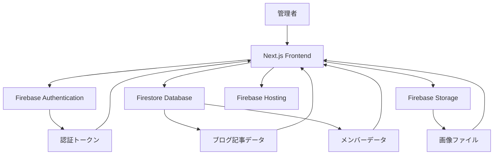
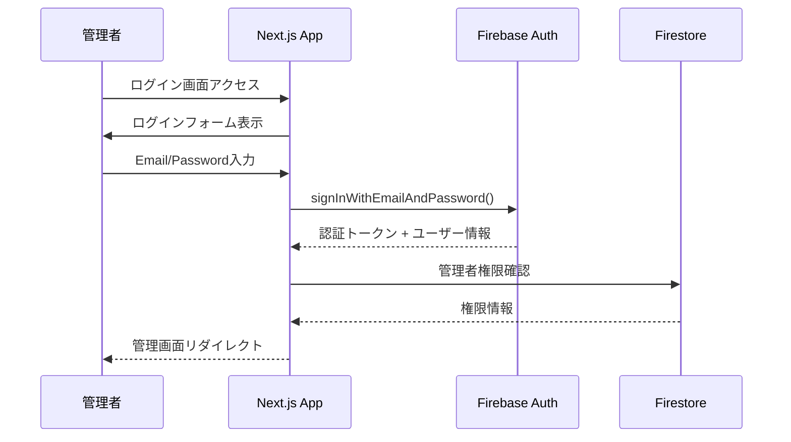
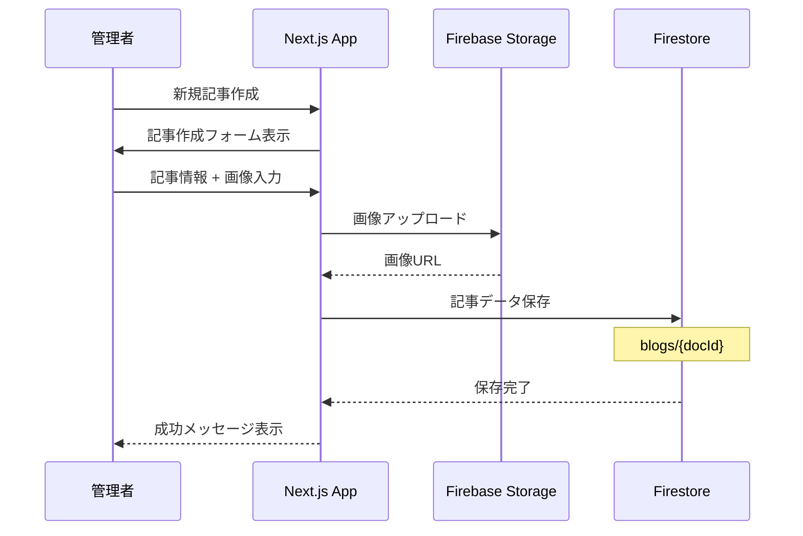
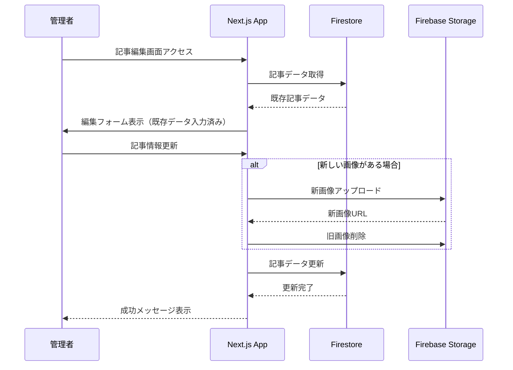
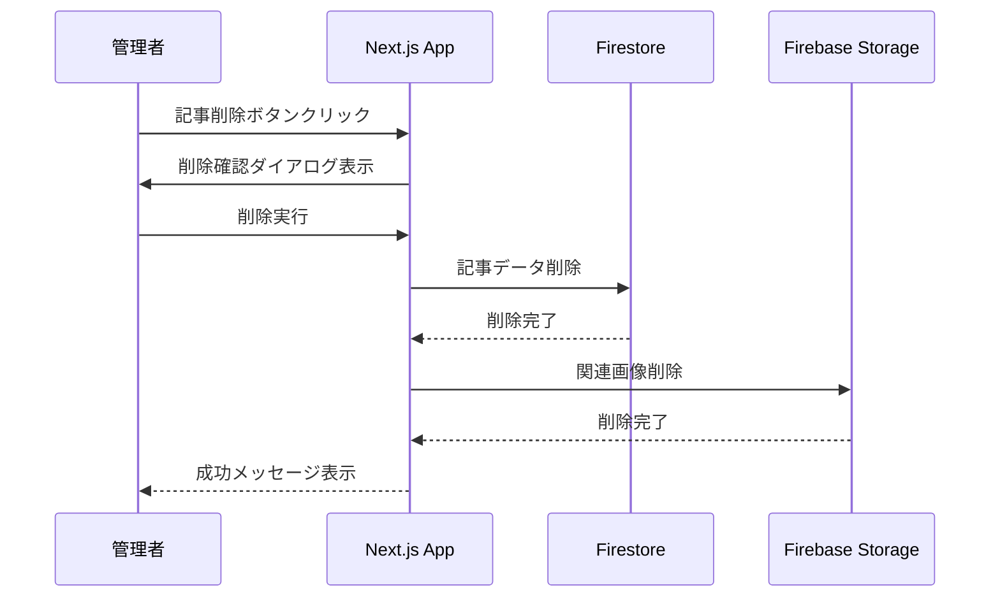
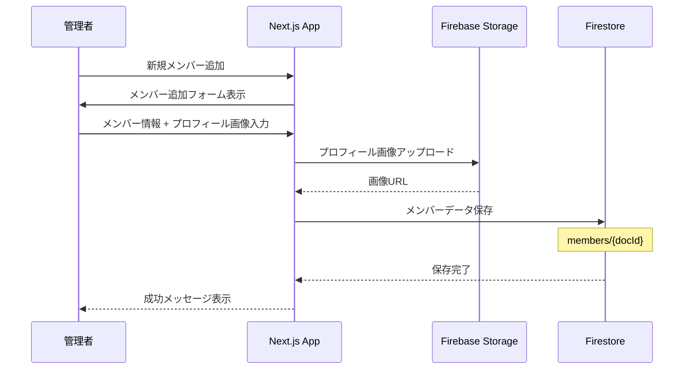
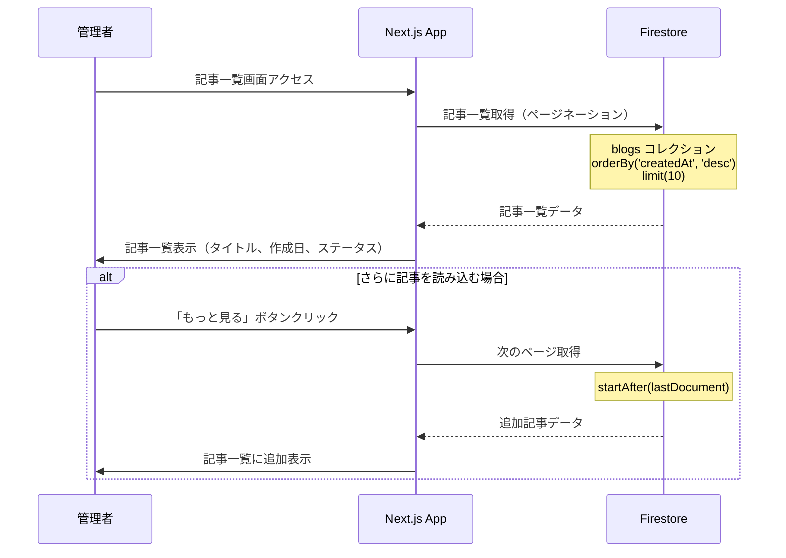
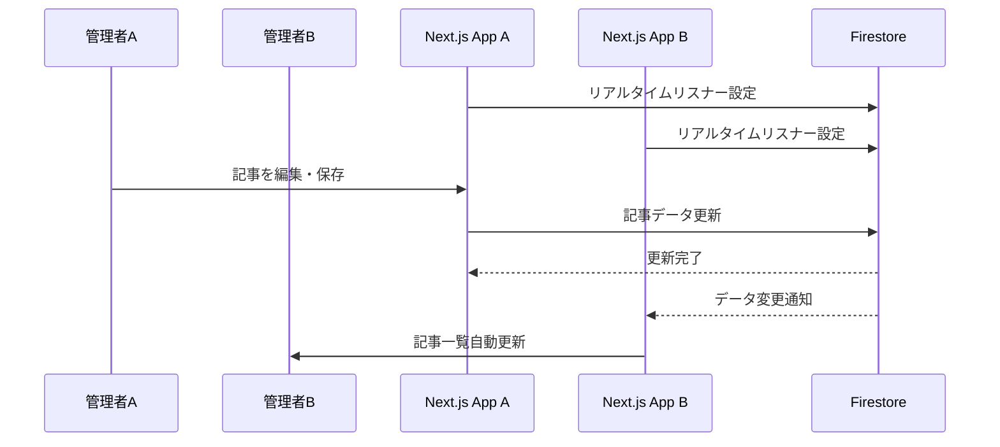
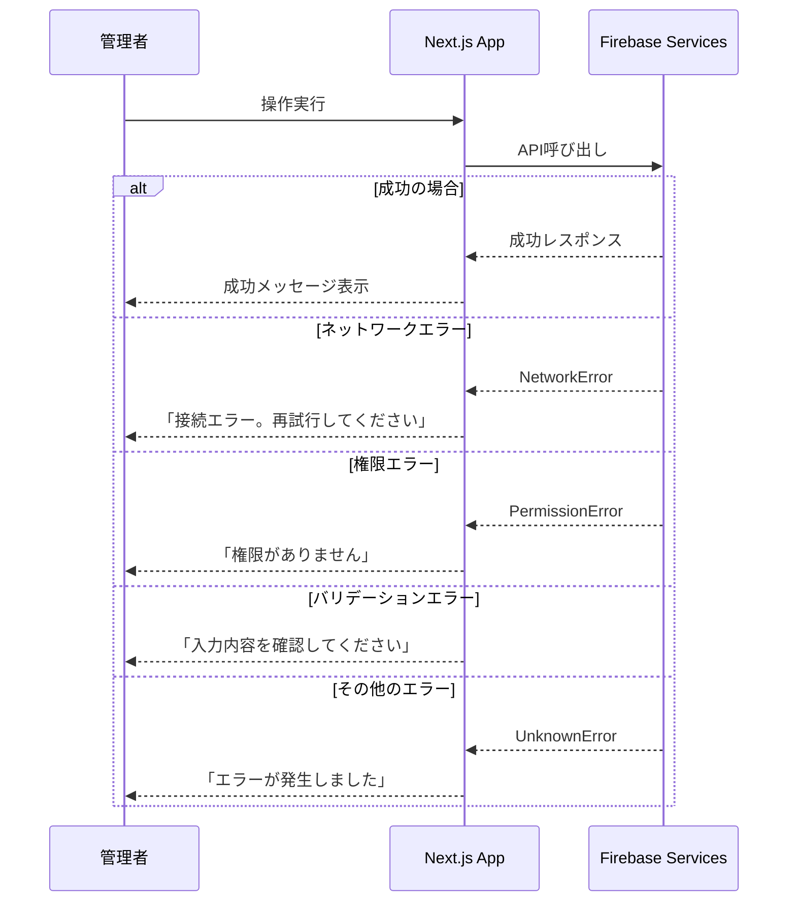

# データフロー図

## システム全体のデータフロー



## 認証フロー



## ブログ記事管理フロー

### 記事作成フロー


### 記事編集フロー


### 記事削除フロー


## メンバー管理フロー

### メンバー追加フロー


## データ取得・表示フロー

### 記事一覧表示フロー


## リアルタイム同期フロー



## エラーハンドリングフロー



## データ構造とフロー

### Firestore コレクション構造
```
/blogs/{blogId}
├── title: string
├── content: string
├── status: "draft" | "published"
├── imageUrl?: string
├── createdAt: timestamp
├── updatedAt: timestamp
└── authorId: string

/members/{memberId}
├── name: string
├── position: string
├── description: string
├── profileImageUrl?: string
├── isActive: boolean
├── createdAt: timestamp
└── updatedAt: timestamp

/users/{userId}
├── email: string
├── name: string
├── role: "admin"
├── createdAt: timestamp
└── lastLoginAt: timestamp
```