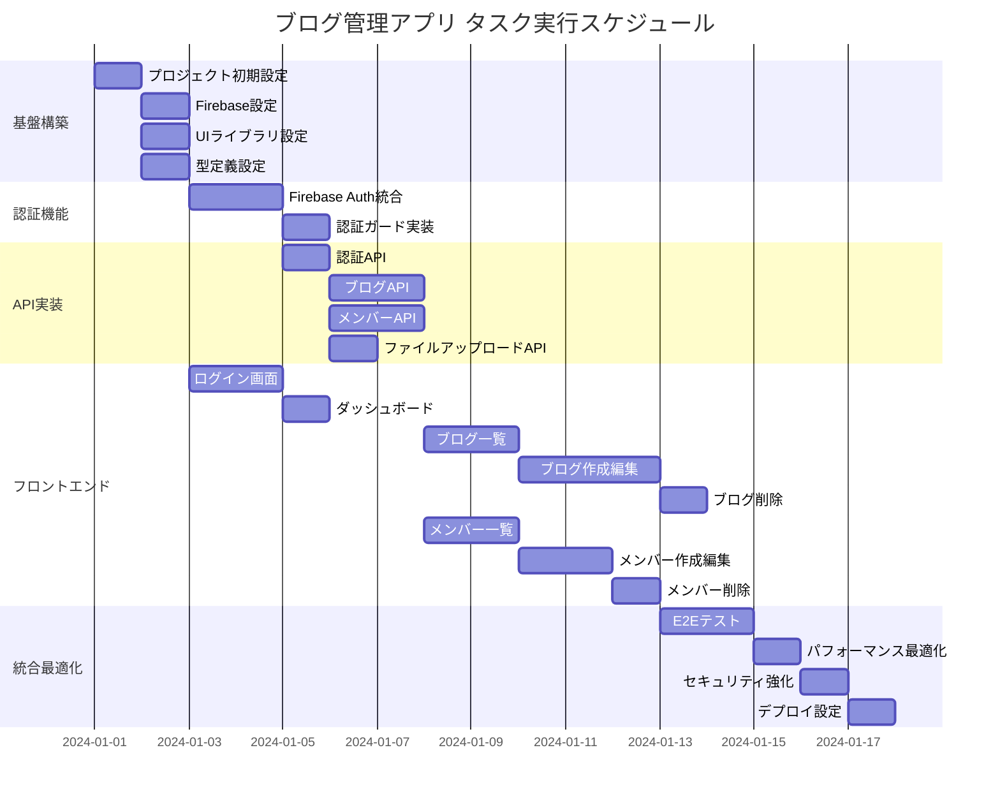

# ブログ管理アプリ 実装タスク

## 概要

全タスク数: 23
推定作業時間: 65-80時間
クリティカルパス: TASK-001 → TASK-002 → TASK-003 → TASK-101 → TASK-201 → TASK-301

## タスク一覧

### フェーズ1: 基盤構築

#### TASK-001: プロジェクト初期設定

- [x] **タスク完了**
- **タスクタイプ**: DIRECT
- **要件リンク**: アーキテクチャ全体
- **依存タスク**: なし
- **実装詳細**:
  - Next.js 14 プロジェクトの作成
  - TypeScript 設定
  - ESLint・Prettier 設定
  - package.json 依存関係設定
- **テスト要件**:
  - [ ] プロジェクト起動テスト
  - [ ] TypeScript コンパイルテスト
  - [ ] Lint 実行テスト
- **完了条件**:
  - [ ] Next.js 開発サーバーが起動する
  - [ ] TypeScript エラーが出ない
  - [ ] ESLint が正常に実行できる

#### TASK-002: Firebase プロジェクト設定

- [ ] **タスク完了**
- **タスクタイプ**: DIRECT
- **要件リンク**: Firebase 構成
- **依存タスク**: TASK-001
- **実装詳細**:
  - Firebase プロジェクト作成
  - Firebase SDK 設定
  - Firestore データベース初期化
  - Firebase Authentication 設定
  - Firebase Storage 設定
  - 環境変数設定
- **テスト要件**:
  - [ ] Firebase 接続テスト
  - [ ] Firestore 読み書きテスト
  - [ ] Storage アップロードテスト
- **完了条件**:
  - [ ] Firebase プロジェクトが作成されている
  - [ ] 全 Firebase サービスが有効化されている
  - [ ] 接続テストが成功する

#### TASK-003: UI ライブラリ設定

- [x] **タスク完了**
- **タスクタイプ**: DIRECT
- **要件リンク**: UI ライブラリ構成
- **依存タスク**: TASK-001
- **実装詳細**:
  - Tailwind CSS 設定
  - Shadcn/ui コンポーネント導入
  - React Hook Form + Zod 設定
  - 基本レイアウトコンポーネント作成
- **テスト要件**:
  - [ ] Tailwind CSS スタイル適用テスト
  - [ ] Shadcn/ui コンポーネント表示テスト
  - [ ] フォームバリデーションテスト
- **完了条件**:
  - [ ] Tailwind CSS が正常に動作する
  - [ ] 基本 UI コンポーネントが使用できる
  - [ ] フォームライブラリが動作する

#### TASK-004: TypeScript 型定義設定

- [ ] **タスク完了**
- **タスクタイプ**: DIRECT
- **要件リンク**: interfaces.ts
- **依存タスク**: TASK-001
- **実装詳細**:
  - 設計書の型定義を lib/types に配置
  - エンティティ型（Blog, Member, User）
  - API 型（Request/Response）
  - UI コンポーネント型
  - enum と定数の定義
- **テスト要件**:
  - [ ] 型定義のコンパイルテスト
  - [ ] enum 値のテスト
  - [ ] 型安全性の確認
- **完了条件**:
  - [ ] 全型定義がエラーなくコンパイルされる
  - [ ] enum が正しく定義されている
  - [ ] 他ファイルからインポート可能

### フェーズ2: 認証機能実装

#### TASK-101: Firebase Authentication 統合

- [ ] **タスク完了**
- **タスクタイプ**: TDD
- **要件リンク**: REQ-401, 認証API
- **依存タスク**: TASK-002, TASK-004
- **実装詳細**:
  - Firebase Auth 初期化
  - メール/パスワード認証実装
  - 認証状態の管理（Context）
  - トークン管理とリフレッシュ
  - 管理者権限確認機能
- **テスト要件**:
  - [ ] 単体テスト: 認証ヘルパー関数
  - [ ] 統合テスト: ログイン/ログアウトフロー
  - [ ] セキュリティテスト: トークン検証
- **エラーハンドリング**:
  - [ ] 無効な認証情報
  - [ ] ネットワークエラー
  - [ ] 権限不足エラー
- **UI/UX要件**:
  - [ ] ローディング状態表示
  - [ ] エラーメッセージ表示
  - [ ] リダイレクト処理

#### TASK-102: 認証ガード実装

- [ ] **タスク完了**
- **タスクタイプ**: TDD
- **要件リンク**: REQ-102
- **依存タスク**: TASK-101
- **実装詳細**:
  - 認証済みユーザーのみアクセス可能なルート保護
  - 管理者権限チェック機能
  - 未認証時のリダイレクト処理
  - ルートレベルでの認証チェック
- **テスト要件**:
  - [ ] 認証ガードの動作テスト
  - [ ] リダイレクト処理テスト
  - [ ] 権限チェックテスト
- **UI/UX要件**:
  - [ ] 認証チェック中のローディング表示
  - [ ] スムーズなリダイレクト

### フェーズ3: API実装

#### TASK-201: 認証 API 実装

- [ ] **タスク完了**
- **タスクタイプ**: TDD
- **要件リンク**: 認証API エンドポイント
- **依存タスク**: TASK-101
- **実装詳細**:
  - POST /api/auth/login
  - POST /api/auth/logout
  - GET /api/auth/me
  - Firebase Admin SDK 統合
  - JWT トークン検証
- **テスト要件**:
  - [ ] API エンドポイントの単体テスト
  - [ ] 認証フローの統合テスト
  - [ ] エラーレスポンステスト
- **エラーハンドリング**:
  - [ ] バリデーションエラー
  - [ ] 認証失敗
  - [ ] サーバーエラー

#### TASK-202: ブログ API 実装

- [ ] **タスク完了**
- **タスクタイプ**: TDD
- **要件リンク**: REQ-001, REQ-002, REQ-003, ブログAPI
- **依存タスク**: TASK-201
- **実装詳細**:
  - GET /api/blogs (一覧取得・検索・ページネーション)
  - GET /api/blogs/[id] (詳細取得)
  - POST /api/blogs (作成)
  - PUT /api/blogs/[id] (更新)
  - DELETE /api/blogs/[id] (削除)
  - Firestore クエリ実装
- **テスト要件**:
  - [ ] CRUD 操作の単体テスト
  - [ ] バリデーションテスト
  - [ ] ページネーションテスト
  - [ ] 検索機能テスト
- **エラーハンドリング**:
  - [ ] リソース未発見
  - [ ] バリデーションエラー
  - [ ] 権限エラー

#### TASK-203: メンバー API 実装

- [ ] **タスク完了**
- **タスクタイプ**: TDD
- **要件リンク**: REQ-004, REQ-005, REQ-006, メンバーAPI
- **依存タスク**: TASK-201
- **実装詳細**:
  - GET /api/members (一覧取得・フィルタリング)
  - GET /api/members/[id] (詳細取得)
  - POST /api/members (作成)
  - PUT /api/members/[id] (更新)
  - DELETE /api/members/[id] (削除)
  - カテゴリ・職位別フィルタ実装
- **テスト要件**:
  - [ ] CRUD 操作の単体テスト
  - [ ] カテゴリフィルタテスト
  - [ ] 職位バリデーションテスト
- **エラーハンドリング**:
  - [ ] 無効なカテゴリ・職位
  - [ ] 重複チェック
  - [ ] データ整合性エラー

#### TASK-204: ファイルアップロード API 実装

- [ ] **タスク完了**
- **タスクタイプ**: TDD
- **要件リンク**: ファイルアップロードAPI
- **依存タスク**: TASK-201
- **実装詳細**:
  - POST /api/upload/blog-image
  - POST /api/upload/member-profile
  - DELETE /api/upload/[path]
  - Firebase Storage 統合
  - ファイル形式・サイズ制限
- **テスト要件**:
  - [ ] ファイルアップロードテスト
  - [ ] ファイル削除テスト
  - [ ] バリデーションテスト
- **エラーハンドリング**:
  - [ ] ファイルサイズ超過
  - [ ] 無効なファイル形式
  - [ ] アップロード失敗

### フェーズ4: フロントエンド実装

#### TASK-301: ログイン画面実装

- [ ] **タスク完了**
- **タスクタイプ**: TDD
- **要件リンク**: REQ-101
- **依存タスク**: TASK-101, TASK-003
- **実装詳細**:
  - ログインフォームコンポーネント
  - フォームバリデーション（Zod）
  - エラー表示・フィードバック
  - 認証状態に応じたリダイレクト
- **UI/UX要件**:
  - [ ] ローディング状態: ボタン無効化 + スピナー
  - [ ] エラー表示: フィールド下にエラーメッセージ
  - [ ] モバイル対応: レスポンシブデザイン
  - [ ] アクセシビリティ: ARIA属性、キーボード操作対応
- **テスト要件**:
  - [ ] コンポーネント単体テスト
  - [ ] フォームバリデーションテスト
  - [ ] E2E ログインフローテスト

#### TASK-302: ダッシュボード画面実装

- [ ] **タスク完了**
- **タスクタイプ**: TDD
- **要件リンク**: 管理画面全体
- **依存タスク**: TASK-301
- **実装詳細**:
  - 管理画面のレイアウト
  - ナビゲーションメニュー
  - ダッシュボード統計表示
  - ログアウト機能
- **UI/UX要件**:
  - [ ] レスポンシブサイドバー
  - [ ] ブレッドクラム表示
  - [ ] ダークモード対応（任意）
- **テスト要件**:
  - [ ] レイアウトコンポーネントテスト
  - [ ] ナビゲーションテスト

#### TASK-303: ブログ一覧画面実装

- [ ] **タスク完了**
- **タスクタイプ**: TDD
- **要件リンク**: REQ-007
- **依存タスク**: TASK-202, TASK-302
- **実装詳細**:
  - ブログ記事一覧表示
  - 検索・フィルタ機能
  - ページネーション
  - ステータス表示（下書き/公開）
  - 操作ボタン（編集・削除）
- **UI/UX要件**:
  - [ ] ローディング状態: スケルトンUI
  - [ ] エラー表示: リトライボタン付きエラーメッセージ
  - [ ] モバイル対応: カード型レイアウト
  - [ ] インフィニットスクロール（任意）
- **テスト要件**:
  - [ ] 一覧表示テスト
  - [ ] 検索機能テスト
  - [ ] ページネーションテスト

#### TASK-304: ブログ作成・編集画面実装

- [ ] **タスク完了**
- **タスクタイプ**: TDD
- **要件リンク**: REQ-001, REQ-002
- **依存タスク**: TASK-202, TASK-204
- **実装詳細**:
  - ブログ作成フォーム
  - ブログ編集フォーム（既存データ読み込み）
  - リッチテキストエディタ（任意）
  - 画像アップロード機能
  - プレビュー機能
  - 下書き保存・公開機能
- **UI/UX要件**:
  - [ ] オートセーブ機能
  - [ ] ファイルドラッグ&ドロップ
  - [ ] プレビューモード切り替え
  - [ ] 文字数カウンター
- **テスト要件**:
  - [ ] フォームバリデーションテスト
  - [ ] ファイルアップロードテスト
  - [ ] 保存・更新機能テスト

#### TASK-305: ブログ削除機能実装

- [ ] **タスク完了**
- **タスクタイプ**: TDD
- **要件リンク**: REQ-003, REQ-105
- **依存タスク**: TASK-303
- **実装詳細**:
  - 削除確認ダイアログ
  - 削除処理実装
  - 関連画像の削除
  - 削除後のフィードバック
- **UI/UX要件**:
  - [ ] 確認ダイアログ: 危険色（赤）での警告表示
  - [ ] 削除中のローディング表示
  - [ ] 成功・失敗フィードバック
- **テスト要件**:
  - [ ] 削除確認ダイアログテスト
  - [ ] 削除処理テスト
  - [ ] エラーハンドリングテスト

#### TASK-306: メンバー一覧画面実装

- [ ] **タスク完了**
- **タスクタイプ**: TDD
- **要件リンク**: REQ-008
- **依存タスク**: TASK-203, TASK-302
- **実装詳細**:
  - メンバー一覧表示
  - カテゴリ別フィルタ（先生・学生）
  - 職位別フィルタ
  - 在籍状況フィルタ
  - 検索機能
- **UI/UX要件**:
  - [ ] カード型レイアウト
  - [ ] プロフィール画像表示
  - [ ] カテゴリ別グループ表示
  - [ ] フィルタ状態の視覚的表示
- **テスト要件**:
  - [ ] 一覧表示テスト
  - [ ] フィルタ機能テスト
  - [ ] 検索機能テスト

#### TASK-307: メンバー作成・編集画面実装

- [ ] **タスク完了**
- **タスクタイプ**: TDD
- **要件リンク**: REQ-004, REQ-005
- **依存タスク**: TASK-203, TASK-204
- **実装詳細**:
  - メンバー作成フォーム
  - メンバー編集フォーム
  - カテゴリ選択（enum）
  - 職位選択（カテゴリ連動）
  - プロフィール画像アップロード
  - フォームバリデーション
- **UI/UX要件**:
  - [ ] カテゴリ変更時の職位選択肢更新
  - [ ] 画像プレビュー機能
  - [ ] 文字数制限表示
  - [ ] 在籍状況のトグルスイッチ
- **テスト要件**:
  - [ ] フォーム入力テスト
  - [ ] カテゴリ・職位連動テスト
  - [ ] 画像アップロードテスト

#### TASK-308: メンバー削除機能実装

- [ ] **タスク完了**
- **タスクタイプ**: TDD
- **要件リンク**: REQ-006, REQ-105
- **依存タスク**: TASK-306
- **実装詳細**:
  - 削除確認ダイアログ
  - メンバー削除処理
  - プロフィール画像削除
  - 削除後のフィードバック
- **UI/UX要件**:
  - [ ] 確認ダイアログでメンバー情報表示
  - [ ] 削除中のローディング表示
  - [ ] 成功・失敗フィードバック
- **テスト要件**:
  - [ ] 削除確認ダイアログテスト
  - [ ] 削除処理テスト
  - [ ] エラーハンドリングテスト

### フェーズ5: 統合・最適化

#### TASK-401: E2Eテストスイート

- [ ] **タスク完了**
- **タスクタイプ**: TDD
- **要件リンク**: 全要件
- **依存タスク**: TASK-308
- **実装詳細**:
  - Playwright/Cypress セットアップ
  - 主要ユーザーフローのテスト
  - 認証フローテスト
  - CRUD操作のE2Eテスト
  - エラーシナリオテスト
- **テスト要件**:
  - [ ] ログイン → ブログ作成 → 公開フロー
  - [ ] メンバー管理フロー
  - [ ] エラーハンドリングテスト
  - [ ] モバイル・デスクトップ両対応

#### TASK-402: パフォーマンス最適化

- [ ] **タスク完了**
- **タスクタイプ**: DIRECT
- **要件リンク**: NFR-001, NFR-002, NFR-003
- **依存タスク**: TASK-401
- **実装詳細**:
  - Firestore クエリ最適化
  - 画像最適化・遅延読み込み
  - コード分割・バンドルサイズ最適化
  - キャッシュ戦略実装
- **テスト要件**:
  - [ ] パフォーマンステスト
  - [ ] ロード時間測定
  - [ ] メモリ使用量チェック
- **完了条件**:
  - [ ] ページ読み込み時間が要件を満たす
  - [ ] バンドルサイズが適切
  - [ ] Core Web Vitals スコア良好

#### TASK-403: セキュリティ強化

- [ ] **タスク完了**
- **タスクタイプ**: DIRECT
- **要件リンク**: NFR-101, NFR-102, NFR-103, NFR-104
- **依存タスク**: TASK-401
- **実装詳細**:
  - Firestore セキュリティルール最終確認
  - XSS対策の実装確認
  - CSRF対策の実装確認
  - セキュリティヘッダー設定
  - 入力値サニタイズ確認
- **テスト要件**:
  - [ ] セキュリティルール テスト
  - [ ] 権限チェックテスト
  - [ ] 入力値検証テスト
- **完了条件**:
  - [ ] セキュリティスキャン合格
  - [ ] 権限制御が正常動作
  - [ ] 脆弱性対策が実装済み

#### TASK-404: デプロイ設定

- [ ] **タスク完了**
- **タスクタイプ**: DIRECT
- **要件リンク**: デプロイメント構成
- **依存タスク**: TASK-403
- **実装詳細**:
  - Firebase Hosting 設定
  - 環境変数管理
  - ビルド・デプロイスクリプト
  - ドメイン設定（任意）
- **テスト要件**:
  - [ ] プロダクションビルドテスト
  - [ ] デプロイ後動作確認
  - [ ] 環境変数設定確認
- **完了条件**:
  - [ ] 本番環境デプロイ成功
  - [ ] 全機能が本番で動作
  - [ ] パフォーマンス要件を満たす

## 実行順序

## マイルストーン

1. **基盤完成** (TASK-004完了): プロジェクト基盤とFirebase連携完了
2. **認証完成** (TASK-102完了): 認証機能実装完了
3. **API完成** (TASK-204完了): 全API実装完了
4. **フロントエンド完成** (TASK-308完了): 全画面実装完了
5. **リリース準備完了** (TASK-404完了): 本番デプロイ可能状態

## 並行実行可能なタスク

- TASK-003, TASK-004 (基盤構築フェーズ)
- TASK-202, TASK-203, TASK-204 (API実装フェーズ)
- TASK-306, TASK-307 (メンバー機能フェーズ)

## 技術的注意事項

### Firebase制限
- Firestore: 1日50,000読み取り（無料枠）
- Storage: 5GB（無料枠）
- Hosting: 10GB転送/月（無料枠）

### パフォーマンス目標
- ページ読み込み: 3秒以内
- CRUD操作: 1秒以内
- Core Web Vitals: Good評価

### セキュリティ要件
- Firestore セキュリティルール必須
- XSS/CSRF対策実装
- ファイルアップロード制限
- 権限ベースのアクセス制御

## サブタスクテンプレート

### TDDタスクの場合

各TDDタスクは以下のプロセスで実装:

1. **tdd-requirements.md** - 詳細要件定義
   - 機能仕様の詳細化
   - 受け入れ基準の明確化
   - ビジネスルールの整理

2. **tdd-testcases.md** - テストケース作成
   - 単体テストケース設計
   - 統合テストシナリオ
   - E2Eテストシナリオ（該当する場合）

3. **tdd-red.md** - テスト実装（失敗）
   - テストコード実装
   - 失敗することの確認
   - テスト環境セットアップ

4. **tdd-green.md** - 最小実装
   - テストを通す最小限の実装
   - 機能の基本動作確認
   - 初期リファクタリング

5. **tdd-refactor.md** - リファクタリング
   - コード品質向上
   - パフォーマンス最適化
   - 設計改善

6. **tdd-verify-complete.md** - 品質確認
   - 全テスト実行確認
   - コードレビュー
   - ドキュメント更新

### DIRECTタスクの場合

各DIRECTタスクは以下のプロセスで実装:

1. **direct-setup.md** - 直接実装・設定
   - 設定ファイル作成
   - 環境構築
   - 依存関係のインストール

2. **direct-verify.md** - 動作確認・品質確認
   - 動作テスト実行
   - 設定値の確認
   - 結合テスト（必要に応じて）